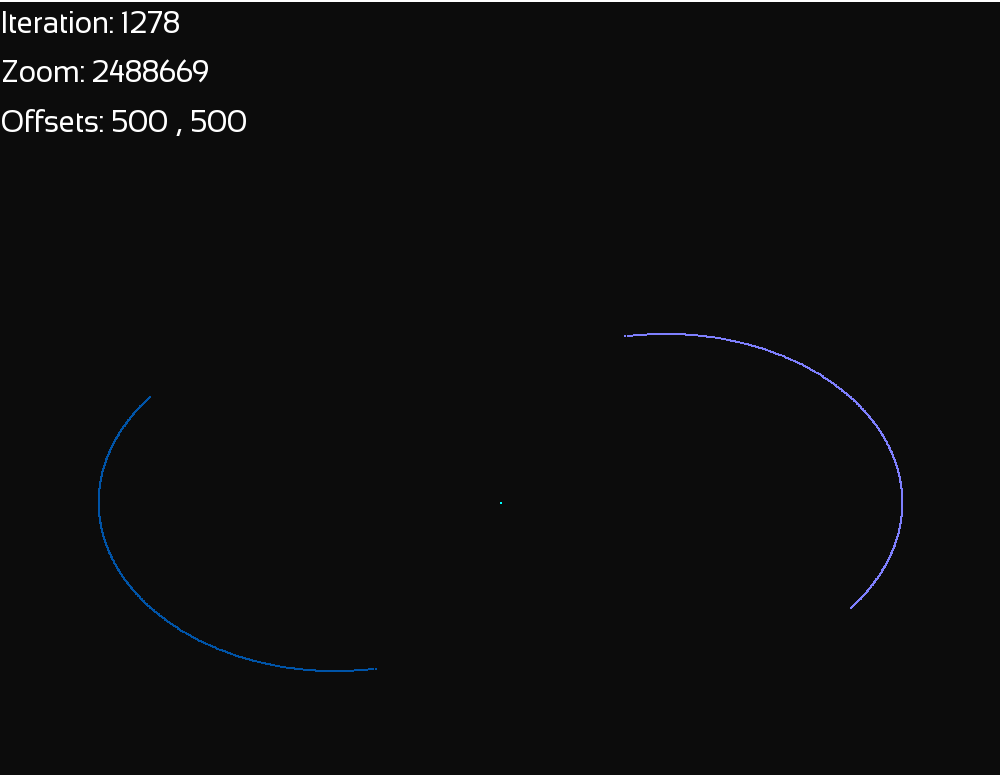

# Grav - sim - cpp
C++ implementation of [https://github.com/obrhubr/grav-sim-py](https://github.com/obrhubr/grav-sim-py). 

## `src/python-read`
`src/python-read` contains a program that creates a `.csv` file that contains the positional data. It can be "replayed" using the included `read.py` file.

## `src/sfml`
`src/sfml` contains a program that displays the positional data live using SFML.

## Compile
Using the included makefiles:
 - `make -f makefile.sfml` for the SFML version
 - `make -f makefile.tocsv` for the version that exports to csv

To compile the SFML program you need to have SFML on path on your `C:` drive or change the path.